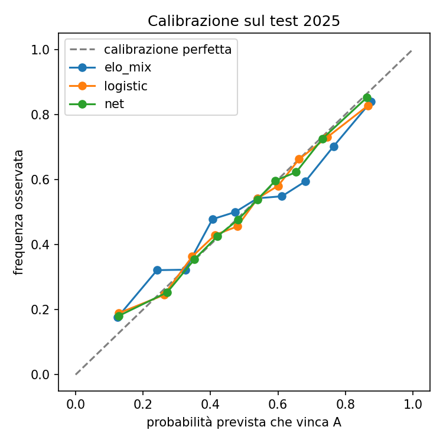
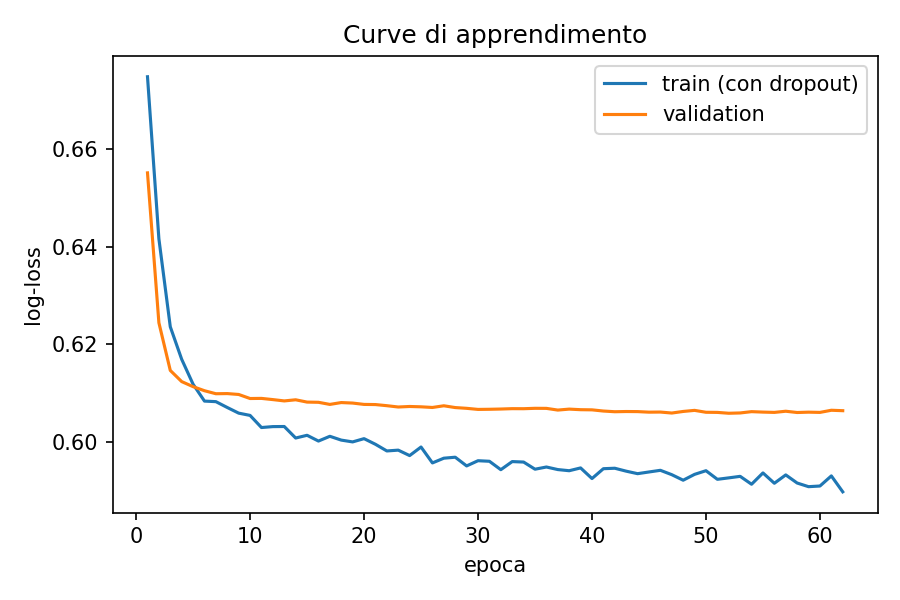
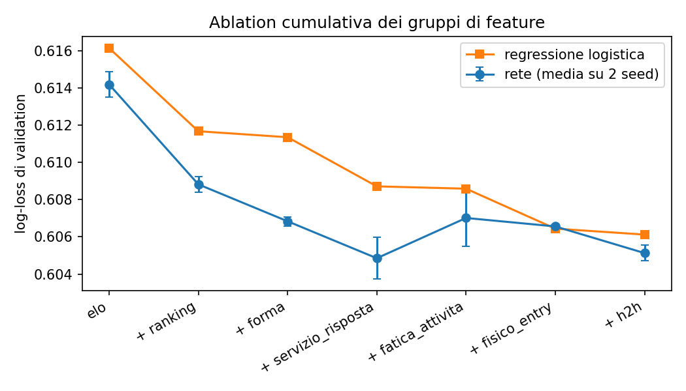

# ATP Match Prediction with an Antisymmetric Neural Network

Predicts the probability that a player wins an ATP tour-level singles match, using only information available before the match. The project is built around a leakage-free chronological pipeline and a rigorous comparison between an antisymmetric neural network and simpler baselines: ranking, Elo, logistic regression and gradient boosting.

On the held-out 2025 season (2,486 matches) the network reaches 66.9% accuracy, 0.613 log-loss and 0.728 AUC. It significantly improves on a surface-weighted Elo baseline, but it is statistically indistinguishable from logistic regression and gradient boosting trained on the same features. With these features, the limiting factor is the information in the data, not model capacity.

## Results

### Test set (2025 season, n = 2,486)

| Model | Accuracy | Log-loss | Brier | AUC |
|---|---|---|---|---|
| Higher-ranked player wins | 0.650 | – | – | – |
| Elo (global) | 0.644 | 0.629 | 0.219 | 0.708 |
| Elo (global + surface) | 0.646 | 0.627 | 0.219 | 0.708 |
| Logistic regression | 0.666 | 0.615 | 0.212 | 0.725 |
| Gradient boosting | 0.660 | 0.614 | 0.213 | 0.721 |
| Antisymmetric network | 0.669 | 0.613 | 0.211 | 0.728 |

The test set was evaluated once, after all modelling choices had been made on the validation set.

Paired bootstrap (2,000 resamples) of the per-match difference in log-loss, network minus other model. A negative value means the network is better; an interval containing zero means the difference is not distinguishable from chance.

| Comparison | Δ log-loss | 95% CI |
|---|---|---|
| Network − Elo (global + surface) | −0.0135 | [−0.0250, −0.0006] |
| Network − logistic regression | −0.0012 | [−0.0052, +0.0027] |
| Network − gradient boosting | −0.0007 | [−0.0086, +0.0080] |

### Calibration



Logistic regression and the network lie close to the diagonal: when they predict 70%, the player wins about 70% of the time. The Elo formula is overconfident in the 0.6–0.75 range and underconfident in the 0.25–0.45 range. The learned models are better calibrated because they directly optimise log-loss.

### Breakdown

Accuracy is highest at Grand Slams (72.2% for the network): over best-of-five sets the stronger player has more time to prevail. It is lowest at Masters 1000 events (64.8%), whose draws are made almost entirely of top players. On grass (287 matches) the Elo baseline has a lower log-loss than the learned models, but the sample is too small for a firm conclusion. Full tables are in `results/test_by_surface.csv` and `results/test_by_level.csv`.

### Training



Validation log-loss stabilises after about ten epochs; early stopping kept the weights of epoch 52. The training curve is computed with dropout active, so it is not directly comparable to the validation curve.

## Feature ablation (validation, 2024 season)

Cumulative ablation: feature groups are added one at a time. Context features are always included.

| Step | Features | Logistic regression | Network (mean ± sd, 2 seeds) |
|---|---|---|---|
| Elo & experience | 3 | 0.6162 | 0.6142 ± 0.0007 |
| + ranking | 6 | 0.6117 | 0.6088 ± 0.0004 |
| + form | 8 | 0.6114 | 0.6068 ± 0.0002 |
| + serve & return | 16 | 0.6087 | 0.6049 ± 0.0011 |
| + fatigue & activity | 19 | 0.6086 | 0.6070 ± 0.0015 |
| + physical & entry | 26 | 0.6064 | 0.6066 ± 0.0001 |
| + head-to-head | 28 | 0.6061 | 0.6051 ± 0.0004 |

Leave-one-group-out with logistic regression. Δ is the increase in log-loss when the group is removed: positive means the group carries information the others do not.

| Group removed | Log-loss | Δ |
|---|---|---|
| Elo & experience | 0.6140 | +0.0079 |
| Ranking | 0.6095 | +0.0033 |
| Serve & return | 0.6085 | +0.0024 |
| Physical & entry | 0.6081 | +0.0020 |
| Form | 0.6075 | +0.0013 |
| Head-to-head | 0.6064 | +0.0003 |
| Fatigue & activity | 0.6059 | −0.0002 |



Elo is the most important group. A network given only the three Elo features (0.6142) already beats the Elo formula on the same validation set (0.6232): part of the gain comes from learning how to use Elo, not from new information. Ranking adds the most on top of Elo, because this Elo sees only tour-level matches while the ranking also reflects Challenger results. Serve and return statistics give a small but consistent gain. Fatigue and head-to-head features add nothing measurable: two players in the same round have almost always played the same number of matches, and head-to-head information is already captured by Elo and ranking. Differences below about 0.002 are within noise, since the ablation uses a single validation season.

## Method

### Data

Match results come from Jeff Sackmann's [tennis_atp](https://github.com/JeffSackmann/tennis_atp) repository: tour-level singles from 2005 to 2025. Davis Cup matches and walkovers are removed. Retirements are kept for the Elo update but excluded from the evaluated samples and from serve statistics, which are partial. After cleaning there are 55,501 matches.

All matches of a tournament share the same date (the Monday of the tournament week), so the chronological order is defined by date, then tournament, then round. This includes round-robin stages and the `ER` rounds of the 2007 round-robin trial events.

### Leakage prevention

Every feature of a match uses only information available before that match. Score, duration and match statistics are used only as history aggregated over previous matches, never for the match itself. Stateful quantities such as Elo are computed with a read-then-update loop: the pre-match value is recorded before the state is updated with the result. Rolling statistics are computed in long format (one row per player per match) with a one-step shift inside each player's history. Automated checks verify that the first match of every player has no history. Imputation and standardisation parameters are estimated on the training set only.

### Elo

A global rating and a per-surface rating are maintained for every player, starting from 1500. The expected score is $E_A = 1 / (1 + 10^{(R_B - R_A)/400})$ and the update is $R_A \leftarrow R_A + K_A (S_A - E_A)$, with a K-factor that decreases with experience, $K = 250 / (m + 5)^{0.4}$, where $m$ is the number of matches played. The seasons from 2005 to 2014 serve only as warm-up, so that ratings are established when the evaluated samples begin in 2015. As a sanity check, the three highest average ratings in 2019 belong to Nadal, Federer and Djokovic.

### Features

Each player is described by 28 features in seven groups:

| Group | Features |
|---|---|
| Elo & experience | global Elo, surface Elo, matches played |
| Ranking | log rank, unranked flag, log ranking points |
| Physical & entry | age, height (with missing flag), left-handed, qualifier, wild card, seeded |
| Form | exponentially weighted win rate (half-life 10 matches), global and per surface |
| Serve & return | serve points won, return points won, first serve in, first- and second-serve points won, break points saved, ace and double-fault rates |
| Fatigue & activity | matches and minutes already played in the tournament, days since the previous tournament |
| Head-to-head | previous meetings and wins against the same opponent |

Serve and return statistics use exponentially weighted averages (half-life 20 matches) of numerator and denominator separately, so each ratio is weighted by the points actually played. Twelve context features describe the match: round, best-of, draw size, surface and tournament level.

### Samples and split

Each match is oriented at random (fixed seed): one player becomes A and the other B, and the target is 1 if A wins. Without this step the target would always be "the winner wins".

| Split | Seasons | Matches |
|---|---|---|
| Train | 2015–2023 | 21,948 |
| Validation | 2024 | 2,795 |
| Test | 2025 | 2,486 |

Missing values are imputed with training medians and features are standardised. Players A and B share the same parameters, estimated on the stacked A and B rows of the training set, because the network applies the same weights to both players.

### Models

The network computes

$$\text{logit}(A, B) = g(x_A, x_B, c) - g(x_B, x_A, c)$$

where $g$ is a shared MLP (two hidden layers of 32 units, ReLU, dropout 0.4), $x_A$ and $x_B$ are the player features and $c$ the context. Swapping the players flips the sign of the logit, so $P(A \text{ beats } B) = 1 - P(B \text{ beats } A)$ holds exactly for any weights, while $g$ can still model interactions such as surface or handedness effects. For the same reason, duplicating matches in both orientations adds no information to training. The network is trained with binary cross-entropy, AdamW (learning rate 3e-4, weight decay 1e-3) and batches of 512, with early stopping on validation log-loss (patience 10).

The baselines follow the same symmetry. Logistic regression uses the feature differences $x_A - x_B$ without an intercept, which makes it antisymmetric by construction. Gradient boosting (scikit-learn `HistGradientBoostingClassifier`) sees $[x_A, x_B, c]$, is trained on both orientations of every match, and its predictions are averaged over the two orientations.

### Hyperparameter tuning

A grid of 16 configurations (hidden size, dropout, weight decay, learning rate) was evaluated on the validation set, with two seeds each. All configurations fall between 0.6051 and 0.6058 log-loss, a spread comparable to the seed-to-seed variation: the network is insensitive to these choices. The smallest and most regularised configuration was kept.

## Limitations

The Elo ratings use only tour-level matches, so players who mostly compete on the Challenger circuit have unreliable ratings; on the test set the ranking alone is more accurate than Elo. Model selection and ablation rely on a single validation season. Dates have weekly resolution, which limits the precision of the fatigue and inactivity features. No comparison with bookmaker odds is included.

## Possible extensions

Natural next steps are to include Challenger and qualifying matches in the Elo computation, drop the fatigue and head-to-head features that the ablation found uninformative, tune the half-lives of the weighted averages, compare against bookmaker implied probabilities, and replace the weighted averages with a sequence model over each player's recent matches.

## Project structure

```
Tennis-predictor/
├── dataset/
│   ├── raw/                 # CSV files from tennis_atp (not included)
│   └── processed/           # generated parquet files
├── models/                  # trained weights and training history
├── results/                 # metric tables and figures
├── src/
│   ├── config.py            # paths, constants, feature lists, hyperparameters
│   ├── data.py              # loading, cleaning, ordering, Elo, pipeline entry point
│   ├── elo.py               # global and surface Elo
│   ├── features.py          # long format and feature engineering
│   ├── split.py             # A/B orientation, temporal split, preprocessing
│   ├── evaluate.py          # metrics
│   ├── baselines.py         # Elo, logistic regression and gradient boosting baselines
│   ├── model.py             # antisymmetric network (with a self-test)
│   ├── train.py             # training with early stopping
│   ├── tune.py              # hyperparameter grid search
│   ├── ablation.py          # feature-group ablation
│   └── final_evaluation.py  # one-shot evaluation on the test set
├── requirements.txt
└── README.md
```

## Reproducing the results

Download `atp_matches_2005.csv` to `atp_matches_2025.csv` from [tennis_atp](https://github.com/JeffSackmann/tennis_atp) into `dataset/raw/`, then:

```bash
pip install -r requirements.txt
cd src
python data.py              # cleaning, ordering, Elo
python features.py          # feature engineering
python model.py             # antisymmetry self-test
python baselines.py         # validation baselines
python tune.py              # hyperparameter search (optional, ~10 min)
python train.py             # final network
python final_evaluation.py  # test set evaluation, figures
python ablation.py          # feature ablation (~10 min)
```

Scripts are run from `src/` because the modules import each other by name. All random operations use fixed seeds.

## Data license

The match data is by Jeff Sackmann / Tennis Abstract and is licensed under CC BY-NC-SA 4.0. It is not redistributed in this repository.